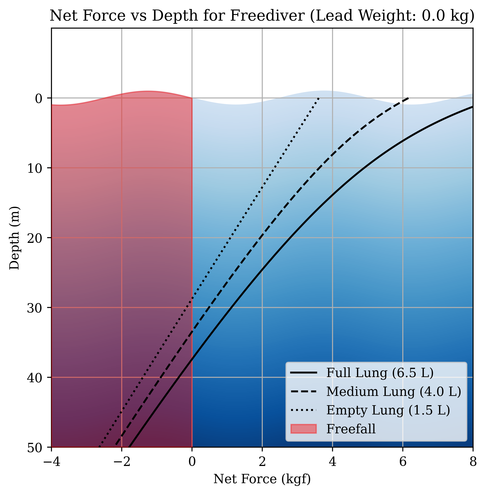

# Freediving Buoyancy Optimization and Freefall Depth Analysis

This repository contains a Python script to calculate and visualize the buoyancy forces acting on a freediver as a function of depth. The tool allows for the optimization of lead weights to achieve a target freefall depth, considering the diver's physiological parameters, equipment, and water conditions.

---

## Problem Statement

The program models the forces affecting a freediver as they descend underwater. Key objectives include:
1. Determining the depth at which the diver transitions into freefall, where the net buoyant force becomes negative.
2. Optimizing the lead weight required for a given diver to achieve neutral buoyancy at a desired depth.

Accurate calculations depend on the diver's body composition, lung volumes, wetsuit properties, and water density, which varies with salinity and temperature.

---

## Example Visualization

The program generates a plot of net force (kgf) vs. depth (m), illustrating:
- **Lines**: Net forces for full, medium, and empty lung volumes.
- **Shaded Areas**:
  - Gradient blue: Ocean depth below the surface.
  - Red: Freefall region where net force is negative.



- **Axes**:
  - X-axis: Net buoyant force (kgf).
  - Y-axis: Depth (m), increasing downward.

---

## Parameters and Physics

### Input Parameters
The program requires the following inputs:

- **Diver Parameters**:
  - `mass` ($m_d$): Diver's body mass in kg.
  - `body_fat_percentage` ($f$): Fraction of body mass composed of fat.
  - `lung_volumes` ($V_l$): Volumes for full, medium, and empty lungs in liters.
  - `residual_volume` ($V_r$): Lung volume that remains unchanged during freefall.

- **Wetsuit and Equipment**:
  - `wetsuit_mass` ($m_w$): Wetsuit mass in kg.
  - `wetsuit_density` ($\rho_w$): Material density in g/cm³.
  - `wetsuit_compressibility_factor`: Volume reduction percentage per meter depth.
  - `lead_weight` ($m_L$): Mass of lead weight in kg.
  - `snorkel_mask_volume` ($V_s$): Volume of snorkel and mask in cm³.

- **Water Properties**:
  - `water_type`: "sea" or "fresh" (determines salinity).
  - `temperature` ($T$): Water temperature in °C.

---

### Physics Model
The net buoyant force on the diver is calculated as:
$$F_{\text{net}} = F_{\text{buoyancy}} - F_{\text{weight}}$$
where:
- $$F_{\text{buoyancy}} = \rho_w V_{\text{disp}} g$$
- $$F_{\text{weight}} = (m_d + m_w + m_L) g$$

#### Buoyant Volume
The displacement volume ($V_{\text{disp}}$) considers:

1. **Body Composition**:
   $$V_{\text{fat}} = \frac{m_d \cdot f}{\rho_{\text{fat}}}, \quad V_{\text{lean}} = \frac{m_d \cdot (1 - f)}{\rho_{\text{lean}}}$$
   where $\rho_{\text{fat}} = 0.9 \, \text{g/cm}^3$ and $\rho_{\text{lean}} = 1.1 \, \text{g/cm}^3$.

2. **Lung Volume at Depth**:
   $$V_l(d) = V_r + \frac{V_l - V_r}{1 + \frac{d}{10}}$$

3. **Wetsuit Compression**:
   $$V_w(d) = V_{w, \text{surface}} \cdot (1 - k \cdot d)$$
   where $k$ is the compressibility factor.

4. **Total Volume**:
   $$V_{\text{disp}} = V_{\text{fat}} + V_{\text{lean}} + V_l(d) + V_w(d) + V_s - \frac{m_L}{\rho_{\text{lead}}}$$

#### Seawater Density
Water density ($\rho_w$) is estimated based on salinity ($S$) and temperature ($T$):
$$\rho_w = 1000 \cdot \left(1 + 0.0008S - 0.0003T\right)$$


---

## Usage

1. Adjust the parameters in the `params` dictionary as needed.
2. Run the script to generate a customized plot:
   ```bash
   python freediving.py
